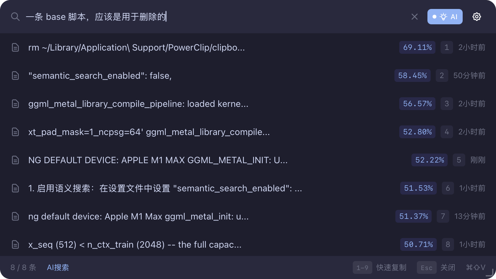

<p align="center">
  <h1 align="center">⚡️ PowerClip</h1>
</p>

<p align="center">
  <strong>A modern clipboard manager built with Rust & Tauri 2.0</strong>
</p>

<p align="center">
  
  
  
  
</p>

<p align="center">
  <a href="#features">Features</a> •
  <a href="#installation">Installation</a> •
  <a href="#keyboard-shortcuts">Keyboard Shortcuts</a> •
  <a href="#development">Development</a>
</p>

<div align="center">

</div>

<br/>


## 📖 Introduction

**PowerClip** is a lightweight, fast, and privacy-focused clipboard history manager.

Powered by **Rust** backend performance and **Tauri** lightweight architecture, PowerClip provides a smooth experience while consuming minimal system resources. All data is stored locally in a SQLite database, ensuring security and control.

## ✨ Features

- ⚡️ **Blazing Fast** - Rust-powered, millisecond startup and search.
- 🔒 **Privacy & Security** - Data stored locally in SQLite (Bundled), no network uploads.
- 📋 **History Tracking** - Automatically monitors and records clipboard text history.
- 🖥 **System Integration** - Perfect system tray support and native window experience.
- ⌨️ **Keyboard First** - Global hotkey to summon, supports full keyboard navigation.
- 🎨 **Modern UI** - Carefully designed interface with React + Tailwind CSS.
- 🔍 **Smart Search** - Embedding-based natural language search



## ⌨️ Keyboard Shortcuts

### Global Operations

| OS | Toggle Window |
| :--- | :--- |
| **macOS** | `Cmd` + `Shift` + `V` |
| **Windows / Linux** | `Ctrl` + `Shift` + `V` |

Tip: Hotkey is customizable

### In-Window Operations

| Key | Action |
| :--- | :--- |
| `↑` / `↓` | Navigate through history |
| `Enter` | Copy selected item and paste |
| `Esc` | Close window |
| `cmd(ctrl) + ,`| Open config file |

## 🛠 Tech Stack

PowerClip uses cutting-edge cross-platform development technologies:

* **Core**: [Rust](https://www.rust-lang.org/) & [Tauri 2.0](https://v2.tauri.app/)
* **Frontend**: [React](https://react.dev/) + TypeScript
* **Styling**: [Tailwind CSS](https://tailwindcss.com/)
* **Database**: SQLite (local storage)
* **Runtime**: [Bun](https://bun.sh/) (build tool)

## 💻 Development

If you want to run locally or contribute, ensure your environment meets these requirements:

### Prerequisites

- **OS**: macOS 10.15+, Windows 10+, or Linux
- **Rust**: 1.70+
- **Node.js / Bun**: Bun 1.0+ recommended

### Getting Started

1. **Clone the project**

```bash
git clone [https://github.com/Skyminers/PowerClip.git](https://github.com/Skyminers/PowerClip.git)
cd power-clip
```

2. **Install dependencies**
```bash
# Install frontend dependencies (bun recommended, npm/pnpm/yarn also work)
bun install

# Download Rust dependencies
cd src-tauri
cargo fetch
cd ..
```


3. **Run development mode**
```bash
# This starts both frontend server and Tauri window with hot reload
bun tauri dev
```


### Build for Release

```bash
bun tauri build
```

Build artifacts will be located in `src-tauri/target/release/bundle`.

## 📄 License

This project is open-sourced under the Apache License 2.0.

---

<p align="center">Made with ❤️ by Sky_miner</p>
