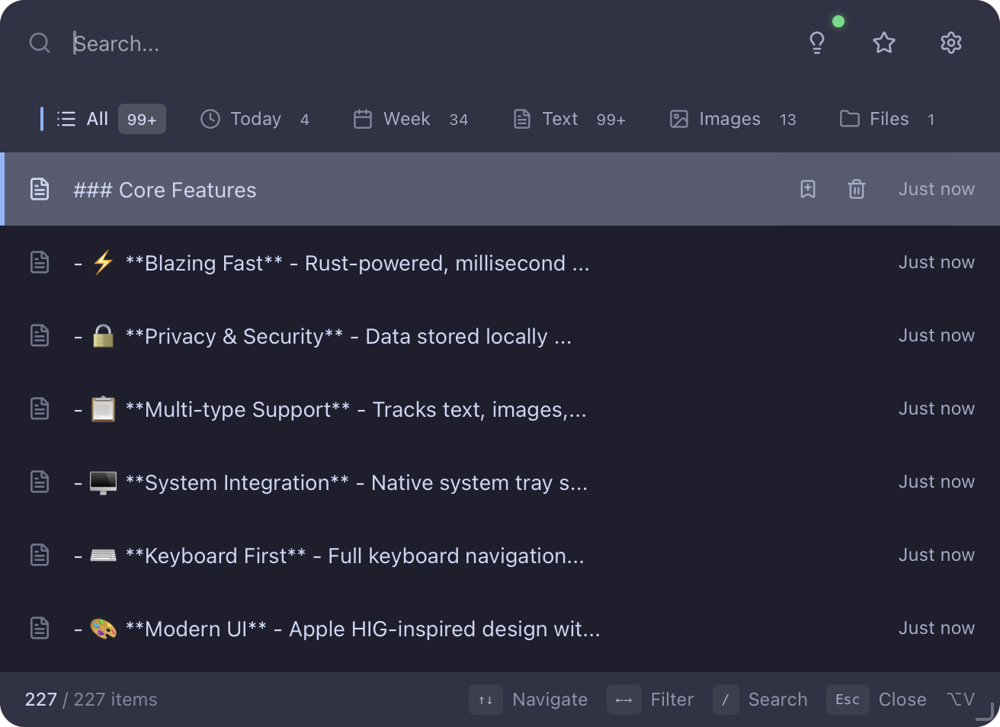

<p align="center">
  <h1 align="center">⚡️ PowerClip</h1>
</p>

<p align="center">
  <strong>基于 Rust & Tauri 2.0 构建的现代化剪贴板管理工具</strong>
</p>

<p align="center">
  
  
  
  
</p>

<p align="center">
  <a href="#功能特性">功能特性</a> •
  <a href="#安装与使用">安装与使用</a> •
  <a href="#快捷键">快捷键</a> •
  <a href="#开发指南">开发指南</a>
</p>

<div align="center">

</div>

<br/>


## 📖 简介

**PowerClip** 是一款轻量、极速且注重隐私的剪贴板历史管理工具。

得益于 **Rust** 后端的强劲性能和 **Tauri** 的轻量化架构，PowerClip 在提供流畅体验的同时，几乎不占用系统资源。所有数据存储在本地 SQLite 数据库中，安全可控。

## ✨ 功能特性

- ⚡️ **极速响应** - Rust 驱动，毫秒级启动与搜索。
- 🔒 **隐私安全** - 数据存储在本地 SQLite (Bundled)，无网络上传。
- 📋 **历史记录** - 自动监听并记录剪贴板文本历史。
- 🖥 **系统集成** - 完美的系统托盘支持与原生窗口体验。
- ⌨️ **键盘优先** - 全局快捷键呼出，支持纯键盘导航操作。
- 🎨 **现代界面** - 基于 React + Tailwind CSS 精心设计的 UI。

## ⌨️ 快捷键

### 全局操作

| 操作系统 | 呼出/隐藏窗口 |
| :--- | :--- |
| **macOS** | `Cmd` + `Shift` + `V` |
| **Windows / Linux** | `Ctrl` + `Shift` + `V` |

### 窗口内操作

| 按键 | 动作 |
| :--- | :--- |
| `↑` / `↓` | 在历史记录中导航 |
| `Enter` | 复制选中内容并粘贴 |
| `Esc` | 关闭窗口 |

## 🛠 技术栈

PowerClip 采用了目前最前沿的跨平台应用开发方案：

* **Core**: [Rust](https://www.rust-lang.org/) & [Tauri 2.0](https://v2.tauri.app/)
* **Frontend**: [React](https://react.dev/) + TypeScript
* **Styling**: [Tailwind CSS](https://tailwindcss.com/)
* **Database**: SQLite (本地存储)
* **Runtime**: [Bun](https://bun.sh/) (构建工具)

## 💻 开发指南

如果你想在本地运行或贡献代码，请确保你的环境满足以下要求：

### 前置要求

- **操作系统**: macOS 10.15+, Windows 10+, 或 Linux
- **Rust**: 1.70+
- **Node.js / Bun**: 建议使用 Bun 1.0+

### 启动开发环境

1. **克隆项目**

```bash
git clone [https://github.com/Skyminers/PowerClip.git](https://github.com/Skyminers/PowerClip.git)
cd power-clip
```

2. **安装依赖**
```bash
# 安装前端依赖 (推荐使用 bun，也可以用 npm/pnpm/yarn)
bun install

# 下载 Rust 依赖
cd src-tauri
cargo fetch
cd ..
```


3. **运行开发模式**
```bash
# 这将同时启动前端服务器和 Tauri 窗口，并支持热重载
bun tauri dev
```


### 构建发布版本

```bash
bun tauri build
```

构建产物将位于 `src-tauri/target/release/bundle` 目录下。

## 📄 许可证

本项目基于 Apache License 2.0 开源。

---

<p align="center">Made with ❤️ by Sky_miner</p>