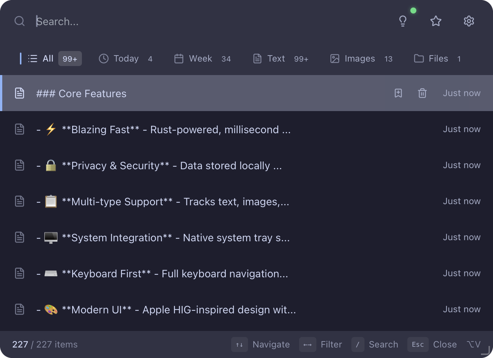

<p align="center">
  <h1 align="center">⚡️ PowerClip</h1>
</p>

<p align="center">
  <strong>A modern, privacy-focused clipboard manager with AI-powered search</strong>
</p>

<p align="center">
  <a href="README.md">English</a> •
  <a href="README_CN.md">简体中文</a>
</p>

<p align="center">
  
  
  
  
</p>

<p align="center">
  <a href="#-features">Features</a> •
  <a href="#-installation">Installation</a> •
  <a href="#️-keyboard-shortcuts">Shortcuts</a> •
  <a href="#-configuration">Config</a> •
  <a href="#-development">Dev</a>
</p>

<div align="center">

</div>

<br/>

## 📖 Introduction

**PowerClip** is a lightweight, fast, and privacy-focused clipboard history manager with AI-powered semantic search capabilities.

Powered by **Rust** backend performance and **Tauri 2.0** lightweight architecture, PowerClip provides a smooth experience while consuming minimal system resources. All data is stored locally in a SQLite database, ensuring your clipboard history stays private and under your control.

## ✨ Features

### Core Features

- ⚡️ **Blazing Fast** - Rust-powered, millisecond startup and search
- 🔒 **Privacy & Security** - Data stored locally in SQLite, no network uploads required
- 📋 **Multi-type Support** - Tracks text, images, and file references
- 🖥 **System Integration** - Native system tray support and window experience
- ⌨️ **Keyboard First** - Full keyboard navigation with customizable global hotkeys
- 🎨 **Modern UI** - Apple HIG-inspired design with smooth animations

### Smart Features

- 🔍 **AI Semantic Search** - Find clipboard items using natural language queries (supports OpenAI-compatible embedding APIs)
- ⭐ **Quick Commands** - Save frequently used snippets with custom aliases for instant access
- 🏷️ **Smart Lists** - Filter history by type (Text/Image/File) or time period (Today/This Week)
- 🔌 **Extensions System** - Run shell commands on clipboard content with custom pipelines
- 📌 **Auto-paste** - Optionally paste content automatically after selection

### Advanced Features

- ⚙️ **Hot-reloadable Config** - Change settings without restarting the app
- 🪟 **Resizable & Draggable** - Window position and size are remembered
- 🌙 **Transparent Window** - Adjustable window opacity for seamless desktop integration

## 📥 Installation

Download the latest release from the [Releases](https://github.com/Skyminers/PowerClip/releases) page:

- **macOS**: Download the `.dmg` file
- **Windows**: Download the `.msi` or `.exe` installer

## ⌨️ Keyboard Shortcuts

### Global Hotkeys

| Action | macOS | Windows / Linux |
| :--- | :--- | :--- |
| Toggle window | `Cmd` + `Shift` + `V` | `Ctrl` + `Shift` + `V` |
| Add clipboard to Quick Commands | `Cmd` + `Shift` + `S` | `Ctrl` + `Shift` + `S` |

> Note: Windows uses `Ctrl` instead of `Cmd`.

> All hotkeys are customizable in the settings file.

### In-Window Navigation

| Key | Action |
| :--- | :--- |
| `↑` / `↓` | Navigate through history |
| `←` / `→` | Switch filter tabs (history) / Toggle views |
| `Enter` | Copy selected item (and paste if enabled) |
| `Tab` | Open extension selector (on selected item) |
| `/` | Focus search input |
| `Esc` | Close window |
| `Cmd/Ctrl` + `P` | Toggle between History and Quick Commands |
| `Cmd/Ctrl` + `,` | Open config file in editor |

## 🔧 Configuration

PowerClip uses a JSON configuration file for all settings. Press `Cmd/Ctrl` + `,` to open it in your default editor.

### Configuration Location

- **macOS**: `~/Library/Application Support/PowerClip/settings.json`
- **Windows**: `%APPDATA%/PowerClip/settings.json`

### Example Configuration

```json
{
  "auto_cleanup_enabled": false,
  "max_items": 100,
  "hotkey_modifiers": "Meta+Shift",
  "hotkey_key": "KeyV",
  "window_opacity": 0.95,
  "auto_paste_enabled": false,
  "semantic_search_enabled": false,
  "embedding_api_url": "https://api.openai.com/v1",
  "embedding_api_key": "sk-...",
  "embedding_api_model": "text-embedding-3-small",
  "embedding_api_dim": 256,
  "add_to_snippets_hotkey_enabled": true,
  "add_to_snippets_hotkey_modifiers": "Meta+Shift",
  "add_to_snippets_hotkey_key": "KeyS",
  "extensions": [
    {
      "name": "Uppercase",
      "command": "tr '[:lower:]' '[:upper:]'",
      "timeout": 5000,
      "close_on_success": true
    }
  ]
}
```

### Key Settings

| Setting | Description | Default |
| :--- | :--- | :--- |
| `max_items` | Maximum history items to keep | `100` |
| `auto_paste_enabled` | Auto-paste after selection | `false` |
| `semantic_search_enabled` | Enable AI-powered search | `false` |
| `embedding_api_url` | OpenAI-compatible API URL | - |
| `embedding_api_key` | API key for embedding service | - |
| `extensions` | List of shell command extensions | `[]` |

## 🤖 AI Semantic Search

PowerClip supports natural language search through embedding APIs. To enable:

1. Set `semantic_search_enabled` to `true` in settings
2. Configure your embedding API credentials:
   - `embedding_api_url`: Any OpenAI-compatible endpoint
   - `embedding_api_key`: Your API key
   - `embedding_api_model`: Model name (e.g., `text-embedding-3-small`)
   - `embedding_api_dim`: Embedding dimension (typically 256-1536)

3. Save the config file - indexing will start automatically

Compatible with OpenAI, Azure OpenAI, and any OpenAI-compatible embedding services.

## 🔌 Extensions

Extensions allow you to process clipboard content through shell commands. When you select an item and press `Tab`, you can choose an extension to run.

### Extension Configuration

```json
{
  "extensions": [
    {
      "name": "JSON Format",
      "command": "python3 -m json.tool",
      "timeout": 5000,
      "close_on_success": true
    },
    {
      "name": "Base64 Encode",
      "command": "base64",
      "timeout": 3000,
      "close_on_success": false
    }
  ]
}
```

- **name**: Display name in the extension selector
- **command**: Shell command to run (clipboard content via stdin)
- **timeout**: Maximum execution time in milliseconds
- **close_on_success**: Whether to close the window after successful execution

## 🛠 Tech Stack

PowerClip is built with modern, cross-platform technologies:

| Layer | Technology |
| :--- | :--- |
| **Core** | [Rust](https://www.rust-lang.org/) & [Tauri 2.0](https://v2.tauri.app/) |
| **Frontend** | [React 18](https://react.dev/) + TypeScript |
| **Styling** | [Tailwind CSS](https://tailwindcss.com/) |
| **Database** | SQLite (bundled, local storage) |
| **Build** | [Bun](https://bun.sh/) |

## 💻 Development

### Prerequisites

- **OS**: macOS 10.15+ or Windows 10+
- **Rust**: 1.70+ (install via [rustup](https://rustup.rs/))
- **Bun**: 1.0+ recommended (install via [bun.sh](https://bun.sh))

### Getting Started

1. **Clone the repository**

```bash
git clone https://github.com/Skyminers/PowerClip.git
cd PowerClip
```

2. **Install dependencies**

```bash
cd frontend
bun install
cd ..
```

3. **Run development mode**

```bash
bun tauri dev
```

This starts both the frontend dev server and Tauri window with hot reload.

### Build for Release

```bash
bun tauri build
```

Build artifacts will be located in `src-tauri/target/release/bundle/`.

### Project Structure

```
PowerClip/
├── src-tauri/           # Rust backend
│   ├── src/
│   │   ├── main.rs      # Application entry point
│   │   ├── commands/    # Tauri command handlers
│   │   ├── db/          # Database operations
│   │   ├── semantic/    # AI search implementation
│   │   ├── clipboard/   # Clipboard monitoring
│   │   ├── hotkey/      # Global hotkey handling
│   │   └── window/      # Window management
│   └── tauri.conf.json  # Tauri configuration
├── frontend/            # React frontend
│   ├── src/
│   │   ├── components/  # UI components
│   │   ├── hooks/       # React hooks
│   │   ├── utils/       # Utility functions
│   │   └── App.tsx      # Main application
│   └── package.json
└── README.md
```

## 📄 License

This project is open-sourced under the Apache License 2.0.

---

<p align="center">Made with ❤️ by Sky_miner</p>
